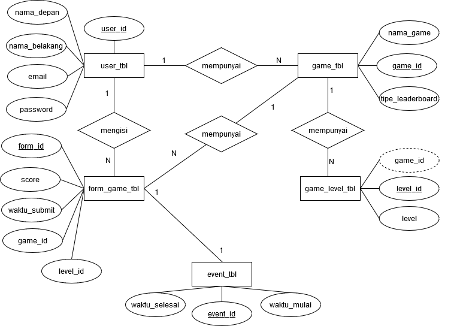
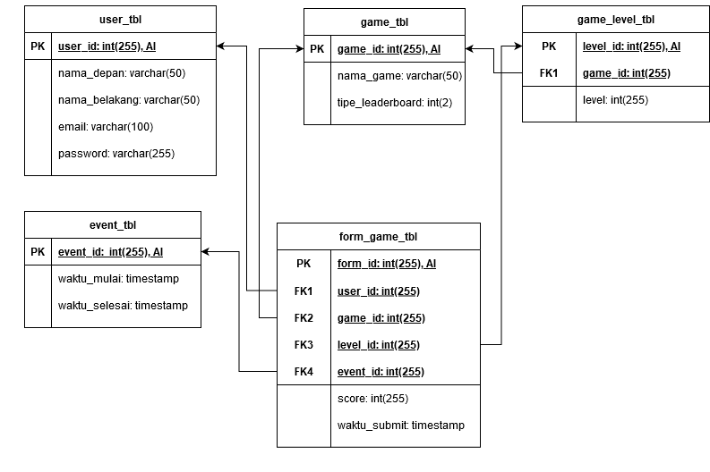

# Game Leaderboard

A simple game leaderboard with MySQL.

## Features
Game leaderboard features are: 
1. User register and login.
2. Submit score user / game.
3. The type of leaderboard is the highest score of all scores submitted.
4. Game has a number of N levels. So that each score is tied to a certain level.
5. Game has start and end period, so each user can only submit score within that time period.  
6. Every user's score are saved into database.
7. There are several games in a system.
8. Each user can submit all games registered to the system.

## Entity Relationship Diagram

Explaination:
1. Tables
    1. `user_tbl` has 5 attributes:
        1. `user_id`: `PRIMARY KEY` of this table
        2. `nama_depan`: first name
        3. `nama_belakang`: last_name
        4. `email`
        5. `password`
    2. `game_tbl` has 3 attributes:
        1. `game_id`: `PRIMARY KEY` of this table
        2. `nama_game`: game name
        3. `tipe_leaderboard`: leaderboard type. For now, it is to decide ascending or descending order.
    3. `game_level_tbl` is the child of `game_tbl` because a game must have registered levels in system. It has 3 attributes:
        1. `level_id`: `PRIMARY KEY` of this table
        2. `game_id`: `FOREIGN KEY` from `game_tbl`
        3. `level`: level figure (Ex: 1, 2, etc)
    4. `event_tbl` has 3 attributes:
        1. `event_id`: `PRIMARY KEY` of this table
        2. `waktu_mulai`: start period
        3. `waktu_selesai`: finish period
    5. `form_game_tbl` has 5 attributes:
        1. `form_id`: `PRIMARY KEY` of this table
        2. `game_id`: `FOREIGN KEY` from `game_tbl`
        3. `level_id`: `FOREIGN KEY` from `level_tbl`
        4. `score`: score of certain game in certain level
        5. `waktu_submit`: time when form is submitted
2. Relationships
    1. Each user can play many games
    2. Each game can have many levels
    3. Each user can submit many forms
    4. Each game can have many forms because of many levels
    5. Each form depends on every event.
    
## Entity Visualisation
